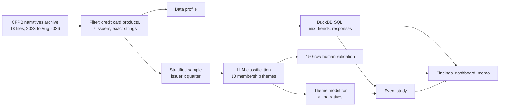

# What Card Members Complain About

Issuer benchmarking of 142,540 CFPB credit card complaints with SQL, an event study and LLM classification.

**Question.** What do US credit card customers complain about at American Express compared with Chase, Capital One, Citi, Bank of America, Discover and Synchrony, and did that change after the 2025 premium card refreshes?

**Answer.** Amex complaints lean toward membership value. Promotional terms not received is 2.5x the peer share and rewards problems 2.0x, and Amex pays monetary relief on them about half as often as peers. Chase's share of fee, rewards and promotional terms complaints rose 4.0 points against comparison issuers after the Sapphire Reserve refresh. Amex's did not rise after the Platinum refresh.

**Recommendation.** Fix welcome offer eligibility clarity first, then rewards posting and forfeiture warnings, then annual fee refund and renewal rules before existing Platinum members finish renewing at the new fee.

[Live dashboard](https://tharun0127.github.io/card-complaint-benchmarking/) · [One-page memo](docs/memo.md) · [Data profile](docs/data_profile.md)


## What this project shows

- **Unlocking external data.** Found, downloaded and profiled a public regulatory archive, checked it against the live API, and documented its gaps before using it.
- **Competitive benchmarking.** Compared seven issuers on a like-for-like basis and explained why the obvious normalization (complaints per dollar of spend) would mislead.
- **SQL and Python.** 11 DuckDB queries, a tested Python pipeline, and one command that rebuilds every number.
- **AI implementation with controls.** LLM classification with a fixed taxonomy, schema-checked output, a hard budget, caching, and a human validation step with precision and recall per class.
- **Turning analysis into decisions.** A one-page memo that answers first and ranks five fixes by evidence.

## Key results

| Finding | Number | Where it comes from |
|---|---|---|
| Complaints analyzed, seven issuers, Jan 2023 to Aug 2026 | 142,540 | [`docs/data_profile.md`](docs/data_profile.md) |
| Complaints with a published narrative | 69,518 | [`docs/data_profile.md`](docs/data_profile.md) |
| Promotional terms not received, Amex share against peers | 7.0% vs 2.8% (2.5x) | [`04_sub_issue_mix_by_issuer.csv`](outputs/sql/04_sub_issue_mix_by_issuer.csv) |
| Rewards problems, Amex share against peers | 6.3% vs 3.2% (2.0x) | [`04_sub_issue_mix_by_issuer.csv`](outputs/sql/04_sub_issue_mix_by_issuer.csv) |
| Monetary relief on promotional terms complaints, Amex against peers | 9.0% vs 20.5% | [`09_relief_rate_by_sub_issue.csv`](outputs/sql/09_relief_rate_by_sub_issue.csv) |
| Monetary relief on fee complaints, Amex against peers | 24.4% vs 38.7% | [`09_relief_rate_by_sub_issue.csv`](outputs/sql/09_relief_rate_by_sub_issue.csv) |
| Amex fee narratives that are about the annual fee, against peers | 35% vs 9% | [`11_keyword_evidence_by_sub_issue.csv`](outputs/sql/11_keyword_evidence_by_sub_issue.csv) |
| Chase fee, rewards and promo share, 12 months before and after its refresh | 16.6% to 20.0% (comparison 13.8% to 13.2%) | [`event_study_summary.csv`](outputs/event_study_summary.csv) |
| Chase difference in differences | +4.0 pts (95% interval 2.6 to 5.5) | [`event_study_summary.csv`](outputs/event_study_summary.csv) |
| Chase narratives naming Sapphire Reserve, before and after | 2.7% to 5.7% | [`event_study_summary.csv`](outputs/event_study_summary.csv) |
| Amex fee, rewards and promo share, before and after the Platinum refresh | 23.9% to 22.6% (-2.1 pts against comparison) | [`event_study_summary.csv`](outputs/event_study_summary.csv) |
| Amex narratives mentioning a statement credit, before and after | 3.0% to 4.5% | [`event_study_summary.csv`](outputs/event_study_summary.csv) |


## Prioritized fixes for Amex

1. **Make welcome offer eligibility clear before the application is submitted.** Promotional terms not received is 7.0% of Amex complaints against 2.8% at the other six issuers (2.5x). 40% of those Amex narratives mention a welcome or bonus offer (peers 19%) and 21% use eligibility wording (peers 8%). Amex closes 9.0% of them with monetary relief, peers 20.5%.
2. **Post rewards reliably and warn before points are lost.** Rewards problems are 6.3% of Amex complaints against 3.2% at peers (2.0x). 27% of the Amex narratives are about a welcome or bonus offer and 11% about points being forfeited or taken back. Monetary relief: Amex 11.5%, peers 20.6%. In the LLM theme labels, rewards and points is 11.0% of Amex narratives against 5.6% at peers.
3. **Set a clear annual fee refund and renewal notice policy ahead of Platinum renewals.** 35% of Amex fee narratives are about the annual fee (peers 9%) and 30% ask about a refund. Amex grants monetary relief on 24.4% of fee complaints, peers 38.7%. About 10% of all Amex narratives mention the annual fee against 2% at comparison issuers. The rate did not rise after the Platinum refresh, so this is a standing issue, and existing members only began renewing at the new fee in January 2026. In the LLM theme labels, annual fee is 4.3% of Amex narratives against 0.8% at peers.
4. **Make statement credits easy to track and fix posting-date edge cases.** Statement credit mentions in Amex narratives went from 3.0% in the 12 months before the Platinum refresh to 4.5% after, while comparison issuers went from 0.5% to 0.8% (difference in differences +1.1 pts, 95% interval 0.0 to 2.2). An early signal on small numbers, worth watching as the refreshed card adds more credits. In the LLM theme labels, statement credit or benefit redemption is 4.6% of Amex narratives against 0.9% at peers.
5. **Explain credit limit reductions when they happen.** Credit limit decisions are 2.4% of Amex complaints against 1.4% at peers (1.7x), on 388 complaints. Smaller than the items above, so it ranks last.

"Application denied" is the largest Amex over-index in the chart above and is deliberately not on this list. Reading those narratives shows mostly identity disputes and template letters citing credit law, not membership problems.

## Proof that it runs

| Claim | Evidence in this repo |
|---|---|
| The data was inspected before any assumption was made | [`docs/data_profile.md`](docs/data_profile.md): rows per file, exact product and company strings, narrative availability by issuer and quarter, field completeness |
| The archive is complete for the study period | [`outputs/api_crosscheck.json`](outputs/api_crosscheck.json): archive counts are within 0.4% of the live CFPB API for every issuer in 2024 and 2025 |
| The structured analysis is plain SQL | [`sql/`](sql): 11 DuckDB queries, each with its result in [`outputs/sql/`](outputs/sql) |
| Filtering, taxonomy parsing and metric logic are tested | [`tests/`](tests): 88 passed (`python -m pytest`) |
| Denominators are cited | [`data/reference/issuer_denominators.csv`](data/reference/issuer_denominators.csv): 60 figures from 10-K filings with URL and quoted table label |
| LLM cost is controlled | [`outputs/cost_estimate.json`](outputs/cost_estimate.json) and the budget guard in [`src/classify.py`](src/classify.py) |
| Every headline number is computed once | [`outputs/findings.json`](outputs/findings.json), which the dashboard, memo and this README are generated from |
| One command rebuilds everything | [`run_all.py`](run_all.py) |

## Method



1. **Data.** The CFPB stopped publishing narratives on 14 August 2026 and keeps an archive. The 18 archive files covering 2023 onward were downloaded and filtered to credit card products and the seven issuers using exact strings read from the data. The live API still serves structured fields and was used only as a cross-check.
2. **Benchmark.** Issuers are compared on complaint mix (shares), not raw counts. Purchase volume from 10-K filings is shown as a scale check only, because the definitions differ (consumer only or with small business, general purpose or private label). On that rough basis Amex had 6.0 complaints per USD 1 billion in 2024, second lowest of seven.
3. **LLM classification.** A stratified sample of 3,990 narratives (by issuer and quarter, larger cells for Amex and Chase) is classified into ten membership themes with sentiment, named benefits and named card product. The model sees only the narrative text. Requests use schema-constrained JSON output, eight complaints per request matched back by id, low thinking effort, and ordinary (non-batch) calls sent four at a time with retries.
4. **Validation.** 150 rows, spread across predicted themes, are pre-labeled and written to `validation/to_label.csv` for hand review. `src/validation.py score` reports agreement, Cohen's kappa, and precision and recall per theme. Unreviewed rows never count as agreement.
5. **Event study.** Difference in differences on shares, Chase and Amex each against five issuers with no refresh, over 6 and 12 month windows, with a placebo range from treating each comparison issuer as if it had the event. Three lenses: CFPB sub-issues, keyword mentions, and the theme model.

## Cost and validation

**Status.** 3,990 of 4,436 sampled narratives were classified with `gemini-3.5-flash-lite` in 499 requests. API usage at list price: USD 1.31 against a USD 10 budget (the key is on the provider's free tier, so the amount billed may be lower). The other 446 rows have no label yet because the free tier's daily request limit was reached. They are a random subset, the weights are rescaled to cover them, and rerunning the classifier continues from the cache. A TF-IDF + logistic regression model trained on those labels agrees with the LLM on 83% of held-out rows and is used only to label every narrative for the monthly event study series.

**Validation.** The 150-row validation set is written to `validation/to_label.csv` with the model's labels filled in. It has not been reviewed by hand yet, so there is no accuracy figure to report.

**Estimate made before the run** for 4,436 narratives in 555 requests (8 per request), in USD. Claude models are priced through the batch API, Gemini models at list price. Token counts: estimated at 3.3 characters per token, not counted by the API.

| Model | Low | Expected | High |
|---|---|---|---|
| `claude-opus-5-5` | 6.92 | 10.44 | 19.89 |
| `claude-sonnet-5-5` | 3.52 | 5.26 | 9.95 |
| `claude-haiku-4-5` | 2.25 | 2.42 | 2.70 |
| `gemini-3.8-flash` | 2.59 | 3.67 | 6.54 |
| `gemini-3.6-flash` | 2.59 | 3.67 | 6.54 |
| `gemini-3.5-flash-lite` | 1.30 | 1.97 | 3.73 |

The classifier refuses to send anything that could take total spend past USD 10. It sends the sample in chunks, measures real token use after the first chunk, and stops if the projection for the rest exceeds the budget. Results are cached in `outputs/llm_labels.jsonl`, so a rerun makes no API calls.

## Theme mix from LLM classification

Weighted shares from 3,990 classified narratives.

| Theme | Amex % | Other six issuers % | Difference (pts) |
|---|---|---|---|
| Dispute or fraud | 29.9 | 36.4 | -6.5 |
| Billing | 23.3 | 31.0 | -7.7 |
| Credit limit or account closure | 18.8 | 19.1 | -0.3 |
| Rewards and points | 11.0 | 5.6 | +5.4 |
| Statement credit or benefit redemption | 4.6 | 0.9 | +3.7 |
| Annual fee | 4.3 | 0.8 | +3.5 |
| Lounge or travel benefit | 2.3 | 1.1 | +1.2 |
| Other | 2.0 | 1.4 | +0.6 |
| Customer service | 2.0 | 2.7 | -0.7 |
| Insurance or protection claim | 1.9 | 1.0 | +0.9 |

## Limitations

- **Complaints are self-selected.** They are not a random sample of customers. A higher share of a topic means it is a larger part of what people escalate to a regulator, not that it happens to more customers.
- **Narratives are a subset.** About half of complaints have a published narrative, and the share drops from December 2025. August 2026 has none.
- **No card product field.** Product-level statements rest on keyword mentions of the card name in narratives.
- **The event study is suggestive, not causal.** Fee increases reached existing cardholders months after launch, the comparison group includes Capital One during its Discover integration, and the Amex pre-period includes an unusually high quarter for annual fee mentions.
- **Discover's label stops in March 2026**, ten months after the merger closed. Capital One figures from April 2026 may include Discover cards.
- **Shares, not rates.** A lower share on one topic can come from a higher share on another.
- **Validation is by one reviewer who sees the model's label**, which can inflate agreement. A blind copy of the validation file can be produced with `--blind`.

## Reproduce

```bash
py -3.11 -m venv .venv
.venv\Scripts\python -m pip install -r requirements.txt
.venv\Scripts\python run_all.py              # no API calls: uses cached labels, or the fallback model
.venv\Scripts\python run_all.py --classify   # needs GEMINI_API_KEY in .env, stops at the USD 10 budget
.venv\Scripts\python -m pytest
```

The first run downloads about 955 MB of archive files to `data/raw/` (not committed).

## Repository map

| Path | Contents |
|---|---|
| `sql/` | DuckDB queries for the structured analysis |
| `src/` | Download, filter, profile, sample, classify, validate, event study, dashboard |
| `tests/` | Filter logic, taxonomy parsing, metric and cost logic, classifier plumbing |
| `outputs/` | Query results, event study tables, cost estimate, findings |
| `docs/` | Dashboard (`index.html`), memo, data profile, screenshots |
| `validation/` | Hand-labeling file and validation report |
| `data/reference/` | Issuer denominators from 10-K filings, with sources |
